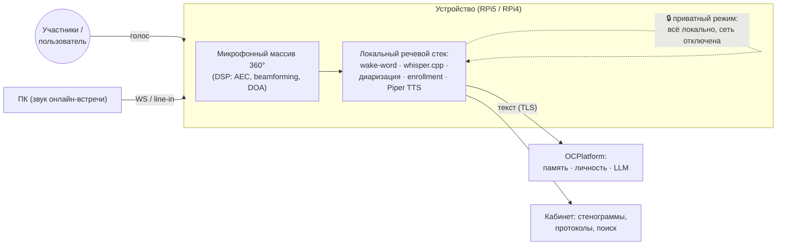

# VikaVoice 🎤

> Открытая аппаратно-программная платформа голосового присутствия AI-ассистента в комнате.
> **Одна Вика — несколько навыков**: транскрайбер и фасилитатор встреч, домашний ассистент —
> и приватный режим, в котором данные **проверяемо** не покидают устройство.

**Статус: концепт-стадия.** Документация — основной артефакт, код — рабочий скелет
(приём аудио по WebSocket с тестами). Дорожная карта — [docs/roadmap.md](docs/roadmap.md),
концепция целиком — [docs/concept/vision.md](docs/concept/vision.md).

## Как это устроено



Подробнее: [обзор архитектуры](docs/architecture/overview.md) ·
[навыки](docs/concept/skills.md) · [приватный режим](docs/architecture/privacy-mode.md) ·
[редакции Edge/Cloud/On-prem](docs/concept/editions.md).

## Почему это интересно

Существующие решения (Otter, Fireflies, tl;dv) пассивны, онлайн-центричны и англоязычны.
**Активного AI-участника офлайн-встречи с локальным приватным режимом на рынке нет** —
разбор конкурентов и сегментов: [docs/concept/market.md](docs/concept/market.md).
Русский язык — основной (whisper.cpp, модель подбирается под платформу —
[ADR-0004](docs/adr/0004-asr-engine.md)).

## Карта репозитория

```text
VikaVoice/
├── docs/                  # документация (единый индекс: docs/README.md)
│   ├── concept/           #   концепция, навыки, сценарии, редакции, рынок
│   ├── architecture/      #   обзор, аудиотракт, данные, деплой, безопасность…
│   ├── adr/               #   архитектурные решения (MADR)
│   ├── reference/         #   протокол ingest, MQTT-топики, конфигурация
│   ├── guides/            #   как запустить ядро, line-in
│   ├── hardware/          #   BOM (CSV) и допущения
│   ├── integrations/      #   УДЯ, ESP-компаньон, AP-настройка
│   ├── compliance/        #   152-ФЗ, 44-ФЗ, карта переиспользования (Meetily)
│   └── roadmap.md         #   эпики EPIC-0..9
├── software/              # программное ядро: ingest (WS) + интерфейсы ASR/enrollment,
│   │                      #   клиент-компаньон, docker, тесты (pytest)
│   └── device/            #   клиент устройства (появится в EPIC-5)
├── hardware/              # промышленный дизайн и CAD корпуса
│   ├── INDUSTRIAL-DESIGN.md   # форм-фактор, решётка, ткань, материалы
│   ├── CASE-COVER.md          # кожух — DIY-опыт сообщества (yaboard/4pda)
│   ├── GRILLE-ATTRIBUTION.md  # атрибуция Yandex Aperiodic Grille (CC BY-SA 4.0)
│   └── grille/                # CAD решётки: original/ (Яндекс) + vika/ (адаптация)
└── procurement/           # черновик ТЗ по 44-ФЗ (Markdown + .docx-экспорт)
```

## Текущий статус

- ✅ Концепция сведена, противоречия разрешены через [ADR](docs/adr/README.md)
  (платформа: RPi5 Edge / RPi4 dev / Zero 2W thin — [ADR-0001](docs/adr/0001-compute-platform.md))
- ✅ Скелет ядра: приём аудио по WS с тестами ([запустить](docs/guides/run-core.md))
- ⏳ EPIC-1: ядро транскрибации end-to-end (whisper.cpp, русский)
- 🔲 Диаризация + «Знакомство» (имена участников по голосу) → протоколы встреч → устройство

## Участие

См. [CONTRIBUTING.md](CONTRIBUTING.md). Решения — через ADR; данные встреч и секреты
в репозиторий не попадают.

## Лицензии

Код — [Apache-2.0](LICENSE); документация (`docs/`, README) — CC-BY-4.0
([ADR-0008](docs/adr/0008-license.md)). Сторонние компоненты —
[THIRD_PARTY_NOTICES.md](THIRD_PARTY_NOTICES.md); заимствования из Meetily (MIT) —
[карта переиспользования](docs/compliance/reuse-map.md).

---

*Проект создан 2026-07-07. Автор: Roman Gudkov ([@Rivega42](https://github.com/Rivega42)).*
