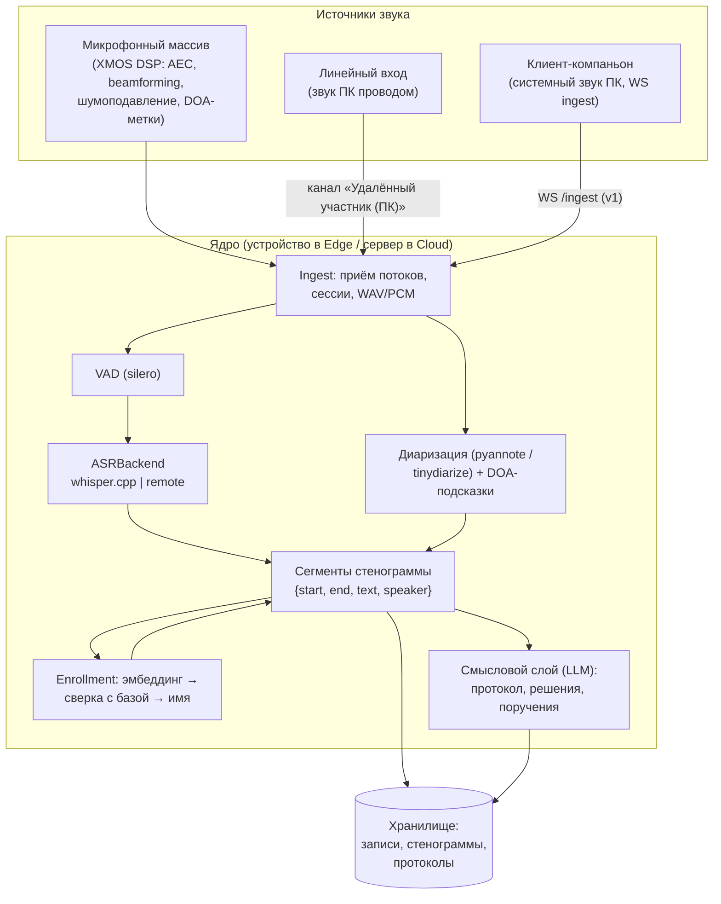

# Аудиотракт: от микрофона до стенограммы

> Статус: 🟡 design (реализация — EPIC-1/2/4) · Обновлено: 2026-07-07 · Связанные ADR:
> [0002 микрофоны](../adr/0002-mic-array.md), [0004 ASR](../adr/0004-asr-engine.md),
> [0009 протокол ingest](../adr/0009-ingest-protocol.md)

## Схема тракта (навыки встреч)

Ключевые принципы:

- **DSP-работа — аппаратно** на массиве (AEC/beamforming/шумоподавление): CPU устройства
  остаётся для ASR/LLM. Слой `software/core/mic_array/` отдаёт «моно-луч + DOA-метки»,
  скрывая конкретный модуль ([ADR-0002](../adr/0002-mic-array.md)).
- **Line-in и компаньон — отдельные каналы**, не смешиваются с локальными голосами:
  реплики помечаются «Удалённый участник (ПК)» — это существенно упрощает диаризацию.
- **DOA как подсказка диаризации**: сектор говорящего сопоставляется с кластером
  диаризации, снижая ошибки при перебивании.
- ASR подключается только через `ASRBackend` (`software/core/asr/base.py`).

## Диалоговый тракт (навык home)

Отличие от навыков встреч: перед VAD стоит wake-word-детектор, после ASR текст уходит
в OCPlatform, ответ озвучивается Piper. Схема — в [overview.md](overview.md#конвейер-запроса-навык-домашний-ассистент).

## Бюджет латентности (цели, не замерено)

| Стадия | Цель (RPi5) | Метод замера |
|--------|-------------|--------------|
| Wake-word → начало записи | < 100 мс | лог с монотонными таймстампами |
| Конец фразы (VAD) → текст (whisper base) | < 1.5 с на фразу 5 с | E5.3 |
| Текст → ответ OCPlatform | < 1 с (p50) | E5.3 |
| Ответ → первый звук TTS (стриминг по предложениям) | < 400 мс | E5.3 |
| **End-to-end ответ ассистента** | **< 3 с (p50)** | критерий EPIC-5 |
| Потоковый транскрипт встречи (задержка сегмента) | < 2 с | черновик ТЗ, хар-ка 26 |

Числа выше — **бюджет**, зафиксированный как цель; фактические замеры появятся в
EPIC-1/EPIC-5 и будут вписаны сюда со ссылкой на методику.

## Открытые вопросы

- Потоковое ASR (chunked whisper) vs пофразовое — что даст приемлемую задержку сегмента.
- Формат обмена DOA-метаданных конкретного модуля (XVF-3000 отдаёт DOA по USB HID;
  XVF3800 — уточнить при bring-up, E4.2).
- Ресемплинг/выравнивание каналов line-in относительно массива (дрейф часов).
