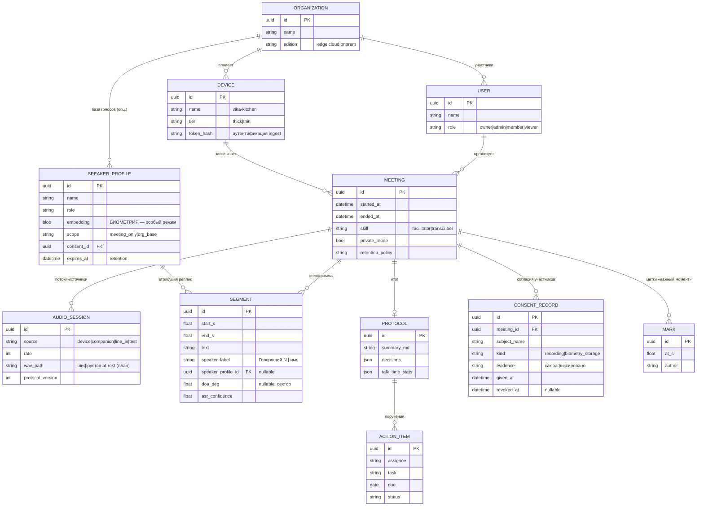

# Модель данных

> Статус: 🟡 design (скелет; реализация — EPIC-1..3, EPIC-7) · Обновлено: 2026-07-07 ·
> Связанные документы: [152-ФЗ](../compliance/152fz.md), [threat model](security-threat-model.md)

## Сущности

## Правила обращения с данными

1. **Биометрия — особый контур.** `SPEAKER_PROFILE.embedding` — биометрические ПДн:
   хранится отдельно от стенограмм, шифруется, имеет обязательный `expires_at` и связь с
   `CONSENT_RECORD`. Scope по умолчанию — `meeting_only` (отпечаток умирает с окончанием
   встречи); `org_base` — только по явному согласию. Открытые правовые вопросы
   (572-ФЗ, уведомление РКН) — [152fz.md](../compliance/152fz.md).
2. **Retention.** У каждой встречи — политика: `keep_all` / `transcript_only`
   (аудио удаляется после чистовой транскрипции) / `ephemeral` (всё удаляется после
   выдачи протокола). Дефолт для приватного режима — `transcript_only` или строже.
   Фоновая задача-чистильщик — обязательная часть EPIC-7.
3. **Шифрование at-rest** аудио и эмбеддингов — требование (пока не реализовано):
   Edge — шифрование раздела данных (LUKS) + ключ вне microSD; Cloud — KMS.
   См. [threat model](security-threat-model.md).
4. **Удаление по запросу субъекта**: каскадное (сегменты → атрибуция → отпечаток),
   фиксируется в журнале аудита.

## Хранилище

- **Скелет (сейчас):** WAV-файлы на диске (`VIKAVOICE_INGEST_DIR`), метаданных нет.
- **EPIC-1..3:** SQLite (по образцу Meetily `backend/app/db.py`) — достаточно для
  одиночного устройства/Edge.
- **EPIC-7 (кабинет, мульти-пользователь):** PostgreSQL + полнотекстовый поиск
  (pg_trgm / tsvector; альтернатива — SQLite FTS5 для Edge). Миграции — alembic.
- Аудио — всегда файлы/объектное хранилище, в БД только пути и метаданные.

## Открытые вопросы

- Формат хранения эмбеддингов (raw float32 vs pgvector) и версии моделей эмбеддера —
  профиль должен знать, какой моделью построен (несовместимость версий).
- Экспортные форматы протокола (docx/pdf) — генерировать на лету или хранить.
- Мульти-тенантность Cloud-редакции (schema-per-org vs row-level) — решить в EPIC-7.
