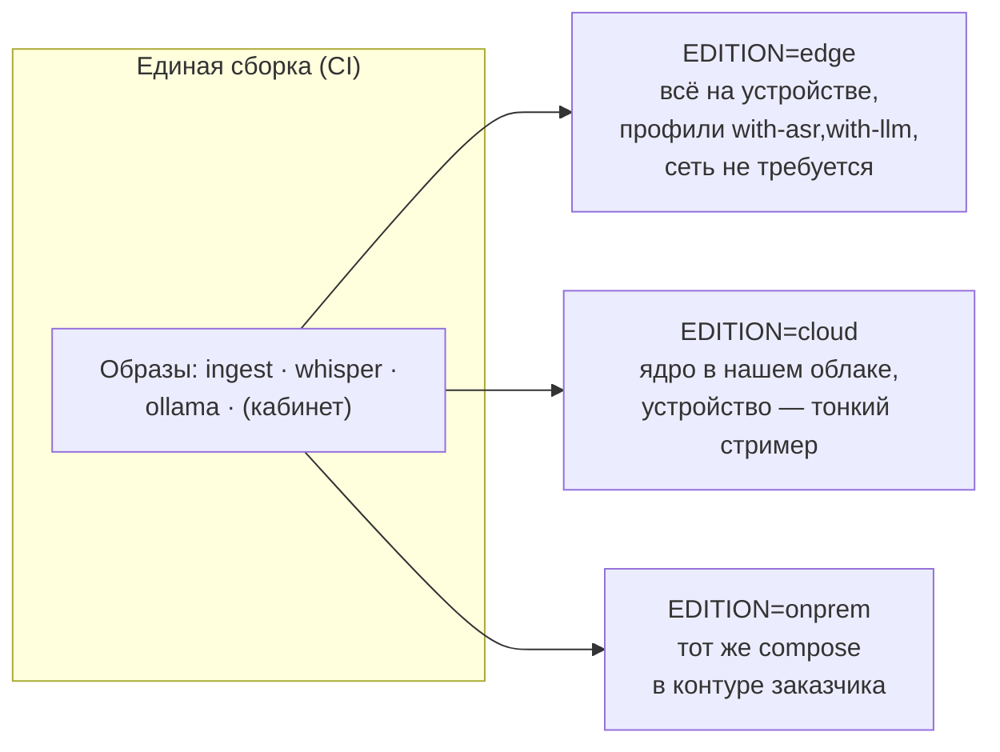

# Деплой: редакции, поставка, обновления

> Статус: 🟡 design (скелет; реализация — EPIC-6/7) · Обновлено: 2026-07-07 · Связанные ADR:
> [0007 редакции](../adr/0007-editions-model.md), [0003 вендоринг](../adr/0003-vendoring-meetily.md)

## Одно ядро → три редакции

Различия редакций выражаются **только конфигурацией** (env + compose-профили), не кодом:

| Аспект | Edge | Cloud | On-prem |
|--------|------|-------|---------|
| Где ingest/ASR/LLM | устройство (RPi5) | наш сервер | сервер заказчика |
| Устройство шлёт | ничего (всё на борту) | аудиопоток (WS, TLS) | аудиопоток в контуре |
| Хранилище | локальный NVMe (шифрование — план) | наше облако | контур заказчика |
| Телеметрия | **off по умолчанию** | on (согласие в договоре) | по выбору заказчика |
| Обновления | вручную/OTA по согласию | мы управляем | пакет поставки |

Текущий скелет: `software/docker-compose.yml` (сервис `ingest` + профили `with-asr`,
`with-llm`). Переменные: `EDITION`, `ASR_BACKEND`, `WHISPER_MODEL`, `WHISPER_LANGUAGE`.

## Поставка на устройство

Целевой путь (EPIC-4/7):

1. **Готовый образ SD/NVMe** (Raspberry Pi OS Lite + наш слой) — собирается скриптом
   (pi-gen или sdm), версионируется. Никаких «ручных инструкций по SSH» как способа
   поставки.
2. Первичная настройка — AP-режим ([integrations/ap-setup.md](../integrations/ap-setup.md)),
   без SSH.
3. Вендоринг Meetily и загрузка моделей — на этапе сборки образа (офлайн-устройству
   негде скачивать), см. открытый вопрос в [ADR-0003](../adr/0003-vendoring-meetily.md).

## Секреты

| Секрет | Где живёт | Правила |
|--------|-----------|---------|
| Токен OCPlatform | `/etc/vikavoice/config.yaml` (0600) | вводится при настройке; не в образе, не в git |
| Токен устройства (ingest) | конфиг устройства + hash на сервере | ротация через кабинет (EPIC-7) |
| HF-токен (веса pyannote) | только на этапе сборки образа | в рантайме не нужен |
| Ключ шифрования данных | TPM/файл вне раздела данных — решить в E6.4 | открытый вопрос |

## Обновления (OTA) — открытый вопрос

Требование появляется с парком > 1 устройства (пилоты, EPIC-8). Кандидаты:

- **RAUC / Mender** — A/B-разделы, атомарный rollback (правильный путь для продукта);
- `docker compose pull` по расписанию — дёшево для пилотов, но не обновляет ОС;
- пакетный путь (apt-репозиторий) — средний вариант.

Решение — отдельным ADR в EPIC-7 (E7.5). Ограничение: Edge-устройства с политикой
«без сети» обновляются только вручную/по явному согласию.

## Открытые вопросы

- Подпись образов и артефактов (защита цепочки поставки) — вместе с выбором OTA.
- Cloud-инфраструктура (где хостим SaaS, IaC) — не раньше EPIC-7.
- Офлайн-инсталлятор для on-prem (docker save/load bundle).
