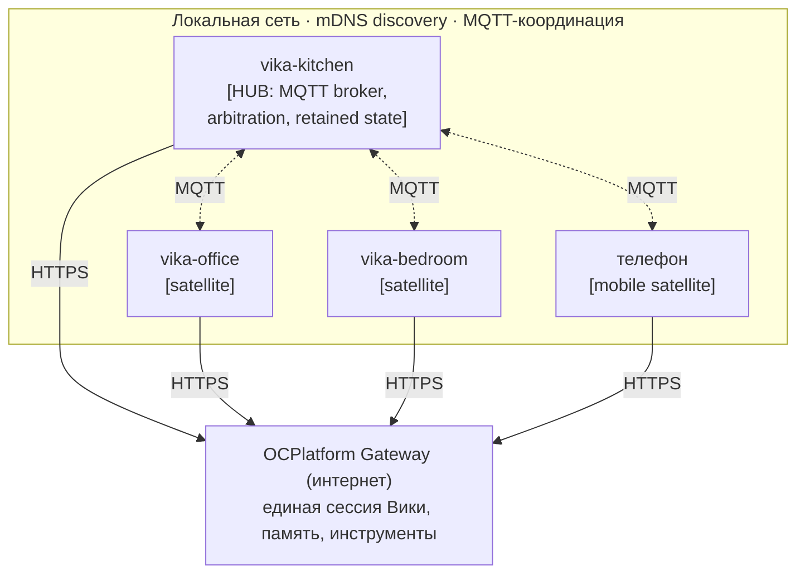
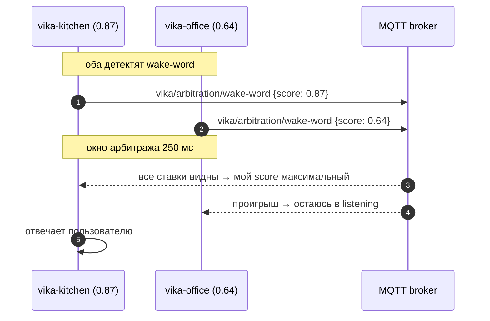

# Multi-Device — несколько Вик как единая система

> Статус: 🟡 design (реализация — EPIC-9) · Обновлено: 2026-07-07 · Связанные ADR:
> [0009 протокол ingest](../adr/0009-ingest-protocol.md) ·
> Справочник топиков: [reference/mqtt-topics.md](../reference/mqtt-topics.md)

> Сценарий: 3–5 устройств VikaVoice расставлены по дому (кухня, кабинет, спальня, детская,
> гостиная). Они должны работать как **одна Вика**, а не как несколько разных.

## Архитектура

**Роли устройств** (логика у всех идентична, роль определяется в рантайме):

- **Hub** — первое устройство в сети: запускает MQTT broker (mosquitto), координирует
  arbitration, хранит retained state. Роль эфемерная: hub упал → leader election
  (по MAC/uptime) назначает следующего.
- **Satellite** — полный стек VikaVoice, подключён к MQTT hub'а, может стать hub'ом.
- **Mobile satellite** — телефон (см. [mobile.md](mobile.md)): в домашнем Wi-Fi участвует
  в координации, вне дома работает напрямую через OCPlatform gateway.

## Ключевые механизмы

### 1. Arbitration — кто отвечает

**Проблема:** «Вика» в коридоре слышат 2–3 устройства — отвечать должно одно.

Confidence score = амплитуда (dB) + SNR + confidence wake-word-модели (0–1).
Подход — как Echo Spatial Perception у Amazon. Если сеть/брокер недоступны — каждое
устройство отвечает само (fail-safe: лучше хором, чем молчание).

### 2. Единый мозг

Все устройства ходят в **одну OCPlatform-сессию** (общий session ID пользователя):
контекст, память и инструменты — на стороне OCPlatform, устройство — «рот и уши».
Это даёт продолжение разговора между комнатами и одну личность вместо трёх.

### 3. Синхронизация состояний

Общий state — через MQTT retained messages (полный справочник —
[mqtt-topics.md](../reference/mqtt-topics.md)):

| Состояние | Scope | Пример |
|-----------|-------|--------|
| Приватный режим | **глобальный** | включён на кухне → красный LED на всех |
| Активный разговор | локальный | только победитель arbitration |
| Таймер/напоминание | по выбору | «через час» → везде; «на кухне через час» → только там |
| Встреча/фасилитация | локальный | одна встреча — одно устройство |
| Домашний режим | **глобальный** | «Вика, я ушёл» → все в passive mode |

### 4. Discovery

mDNS/Zeroconf: каждое устройство анонсирует `_vika._tcp.local` с полями
`role=hub|satellite`, `room=kitchen`; hostname вида `vika-kitchen.local`.
Первое устройство в сети становится hub'ом, новые — satellite.

### 5. Handoff — переход разговора между комнатами

1. Кухня детектит «пользователь ушёл» (тишина по VAD > 3 c).
2. Кабинет детектит новый голос + wake-word (или продолжение фразы).
3. Arbitration выигрывает кабинет.
4. Session ID тот же → OCPlatform продолжает контекст без разрыва.
5. Ответ звучит из кабинета; «перевозится» текст последней реплики, не аудио.

Нужно: voice fingerprinting (узнавать «своего» пользователя — переиспользуем
enrollment-стек), session pinning в OCPlatform (< 500 мс на смену source device).

### 6. Multi-room audio (позже)

Синхронное воспроизведение музыки/объявлений: кандидаты — **Snapcast** (Linux-native,
синхронизация ~1 мс), PulseAudio RTP (проще), AirPlay 2 (совместимость с Apple).
Ответы Вики играет победитель arbitration; broadcast — опционально.

## Сценарии

1. **«Вика» слышат двое:** кухня 0.87 vs кабинет 0.64 → отвечает кухня, кабинет в listening.
2. **Приватный режим у психолога:** «Вика, приватный режим на 2 часа» → retained-флаг →
   **все** устройства: красный LED, локальные LLM, сеть отключена; через 2 часа таймер
   снимает флаг.
3. **Локальный таймер:** «поставь таймер на 15 минут для яиц» на кухне → звенит кухня;
   глобальная формулировка → звенят все.
4. **Broadcast:** «Вика, скажи всем: ужин готов» → hub рассылает
   `vika/broadcast/announce` → все проговаривают через Piper.
5. **Handoff телефон → дом:** разговор в наушниках в машине; дома телефон входит в Wi-Fi,
   публикует `vika/state/user-arrived-home`; кухонное устройство спрашивает «продолжим?» —
   сессия переезжает, в наушниках тишина. Подробнее —
   [mobile.md](mobile.md#handoff-между-телефоном-и-домашней-викой).

## Открытые вопросы

- **Voice fingerprinting**: отдельная модель эмбеддингов (Whisper голоса не различает) —
  переиспользовать enrollment-стек из навыков встреч.
- **Latency arbitration**: достаточно ли 250 мс, не заметит ли пользователь паузу.
- **Приватный режим на парке**: satellite без локальной LLM в приватном режиме = молчащая
  коробка → требование к RAM всех устройств или деградация «только транскрипция».
- **OTA-обновления** парка устройств — см. [deployment.md](deployment.md#ota).
- **Подключение второго устройства**: через тот же AP-режим первичной настройки или
  автоматически через hub.

## Референсы

- Amazon Echo ESP (Echo Spatial Perception): https://developer.amazon.com/en-US/docs/alexa/alexa-voice-service/esp.html
- Home Assistant Voice PE + Wyoming Protocol: https://www.home-assistant.io/voice_control/voice_remote_expansion/
- Snapcast: https://github.com/badaix/snapcast
- Rhasspy (multi-room open-source ассистент): https://rhasspy.readthedocs.io/

## Что закладывается уже в MVP

MQTT client stub, mDNS discovery, session ID в контракте с OCPlatform — чтобы не
переписывать с нуля (задачи в [roadmap](../roadmap.md), EPIC-5/EPIC-9).
