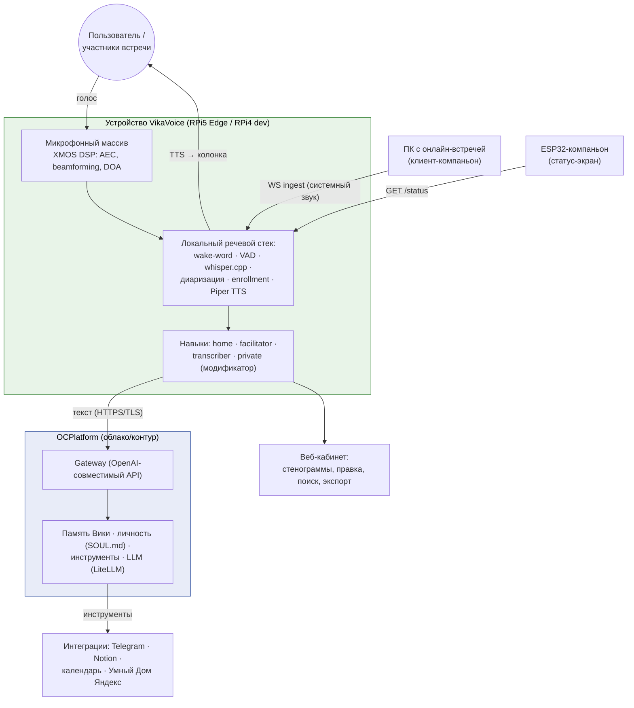
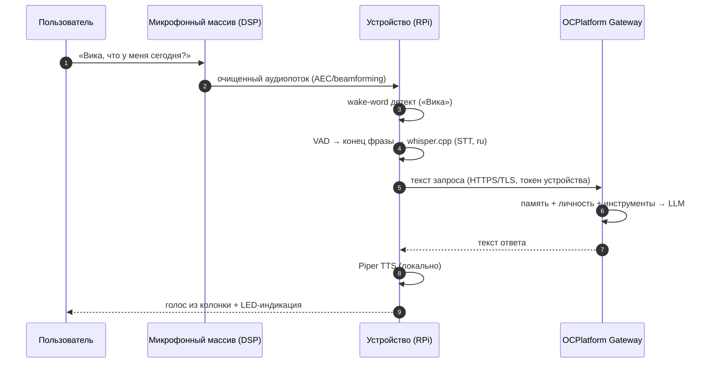

# Архитектура: обзор

> Статус: ✅ актуален · Обновлено: 2026-07-07 · Связанные ADR:
> [0001 платформа](../adr/0001-compute-platform.md), [0002 микрофоны](../adr/0002-mic-array.md),
> [0004 ASR](../adr/0004-asr-engine.md), [0005 TTS](../adr/0005-tts-engine.md),
> [0007 редакции](../adr/0007-editions-model.md)

## Контекст системы

В **приватном режиме** связь с облаком полностью отключается — обработка (включая LLM)
остаётся на устройстве. Подробно: [privacy-mode.md](privacy-mode.md).

## Конвейер запроса (навык «домашний ассистент»)

Полный аудиотракт (VAD, диаризация, enrollment, line-in) — [audio-pipeline.md](audio-pipeline.md).

## Распределение компонентов

### Локально на устройстве

| Компонент | Технология | Зачем локально |
|-----------|-----------|----------------|
| Обработка звука | XMOS DSP (AEC, beamforming, DOA) | аппаратно, без нагрузки на CPU — [ADR-0002](../adr/0002-mic-array.md) |
| Wake-word | openWakeWord / Sherpa-ONNX | всегда слушает, без интернета — [ADR-0006](../adr/0006-wake-word.md) |
| VAD | silero-vad | детект конца фразы |
| STT | whisper.cpp (модель по платформе) | скорость + приватность — [ADR-0004](../adr/0004-asr-engine.md) |
| Диаризация | pyannote (навыки встреч) | кто говорит |
| Enrollment | голосовые отпечатки (ECAPA/pyannote) | имена участников в стенограмме |
| TTS | Piper (ru) | латентность, офлайн — [ADR-0005](../adr/0005-tts-engine.md) |
| Локальная LLM | llama.cpp / Ollama, модель 1–3B | только приватный режим — [privacy-mode.md](privacy-mode.md) |

### В облаке / контуре (OCPlatform)

| Компонент | Зачем не на устройстве |
|-----------|------------------------|
| Основная LLM | вычислительно тяжело для RPi |
| Память Вики | сохраняется между сессиями и поверхностями (устройство = тот же ассистент, что в Telegram) |
| Инструменты (календарь, задачи, интеграции) | требуют сети и учёток |
| Личность и контекст (SOUL.md, MEMORY.md) | единая личность для всех устройств |

Адрес gateway и токен — параметры конфигурации устройства
([reference/configuration.md](../reference/configuration.md)); адреса инфраструктуры в
документации не публикуются. Транспорт — только TLS.

## Навыки

Подробно — [concept/skills.md](../concept/skills.md). Сводка:

| Навык | Триггер | Активная роль | Данные наружу |
|-------|---------|---------------|---------------|
| 🏠 Home | wake-word «Вика» | разговор | → OCPlatform (TLS) |
| 🎯 Facilitator | «начнём встречу» | модерация встречи | → OCPlatform (TLS) |
| 📝 Transcriber | «просто запиши» | молча пишет + суммирует | локально; суммаризация — по редакции |
| 🔒 Private | «приватный режим» | модификатор поверх остальных | **никуда** |

## Редакции

Одно ядро обслуживает редакции Edge / Cloud / On-prem / гибрид конфигурацией —
[ADR-0007](../adr/0007-editions-model.md), технические детали — [deployment.md](deployment.md).

## Связанные документы

- [Модель данных](data-model.md) · [Деплой](deployment.md) ·
  [Наблюдаемость](observability.md) · [Модель угроз](security-threat-model.md)
- [Multi-device](multi-device.md) и [мобильный клиент](mobile.md) — 🟡 design, горизонт EPIC-9
- [Протокол ingest](../reference/api/ingest-ws.md) · [MQTT-топики](../reference/mqtt-topics.md)
