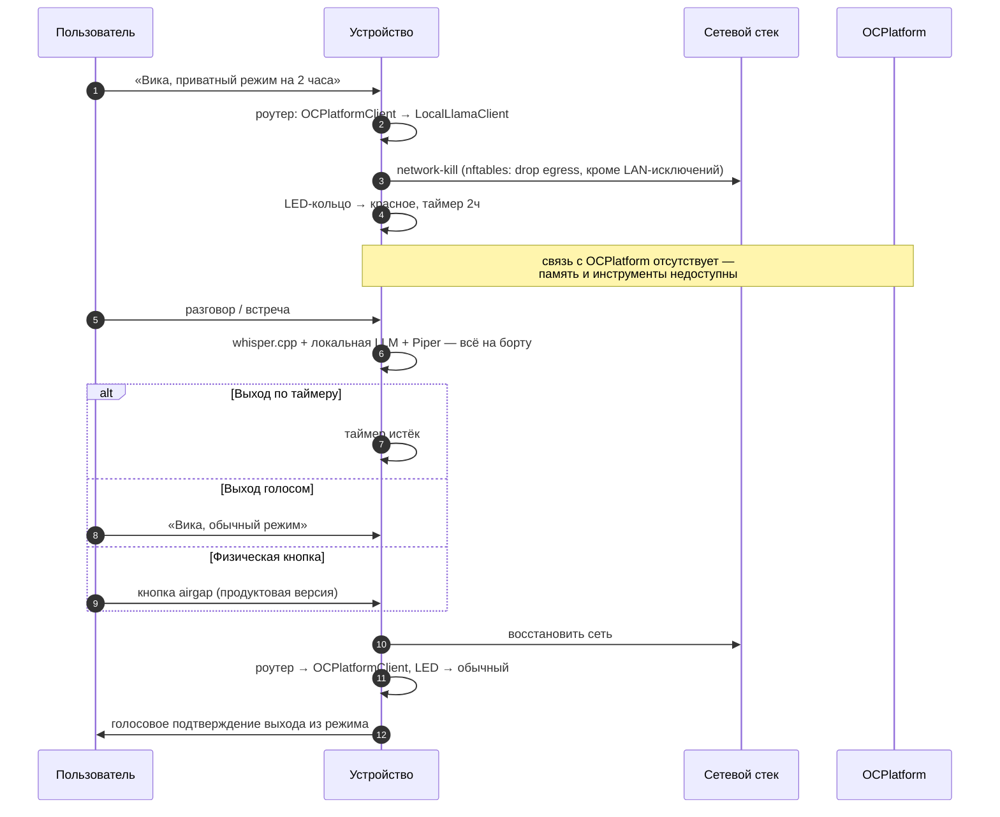

# Приватный режим: модель гарантий

> Статус: 🟡 design (реализация — EPIC-6) · Обновлено: 2026-07-07 · Связанные документы:
> [skills](../concept/skills.md), [threat model](security-threat-model.md),
> [152-ФЗ](../compliance/152fz.md)

Приватный режим — ключевая фича продукта: **проверяемое** отсутствие передачи данных
наружу, а не обещание. Для юристов, врачей, психологов это требование, а не удобство.

## Переключение режима

## Уровни гарантий

| Уровень | Механизм | Кому достаточно |
|---------|----------|-----------------|
| L1. Логический | роутер запросов переключён на локальные бэкенды | бытовое использование |
| L2. Сетевой | `nftables` drop egress + автотест «нет пакетов наружу» (tcpdump) | психологи, NDA-встречи |
| L3. Физический | airgap-кнопка разрывает питание сетевых интерфейсов; аппаратный mute микрофонов | юристы, режимные объекты |

Правило: **режим считается включённым только после подтверждения L2** (после network-kill),
не после смены роутера. Индикация (красный LED) загорается последней — когда гарантия
фактически действует.

## Что работает / что теряется

| Возможность | В приватном режиме |
|-------------|--------------------|
| Транскрипция (whisper.cpp base, ru) | ✅ без изменений (и так локальная) |
| TTS (Piper) | ✅ без изменений |
| Диаризация, enrollment | ✅ локально (эмбеддер на устройстве) |
| Ответы LLM | 🟡 локальная модель 1–3B (llama.cpp/Ollama) — качество ниже; выбор модели с учётом лицензии весов ([THIRD_PARTY_NOTICES](../../THIRD_PARTY_NOTICES.md)) |
| Суммаризация встречи | 🟡 базовая, локальной моделью |
| Долгосрочная память Вики (OCPlatform) | ❌ недоступна — честно сообщать голосом |
| Инструменты (календарь, Notion, УДЯ) | ❌ недоступны |

## Проверяемость (обязательные тесты, EPIC-6)

1. **Автотест изоляции**: в приватном режиме `tcpdump` на egress-интерфейсах за N минут
   активного диалога фиксирует 0 пакетов наружу (допустимые исключения — ARP/локальный
   mDNS, список фиксируется явно; в строгом профиле — вообще ничего).
2. **Тест деградации**: запрос инструмента («поставь в календарь») в приватном режиме →
   голосовой отказ с объяснением, без сетевых попыток.
3. **Сценарий психолога**: Ethernet физически отключён до старта — устройство полностью
   функционально в рамках локальных возможностей.

## Multi-device

Приватный режим — глобальное состояние парка: retained-флаг в MQTT переводит **все**
устройства (красный LED везде). Satellite без локальной LLM деградирует до «только
транскрипция». См. [multi-device.md](multi-device.md#3-синхронизация-состояний).

## Открытые вопросы

- MQTT внутри LAN в приватном режиме: локальный трафик допустим (не покидает периметр),
  но в строгом профиле L3 устройство одиночное — зафиксировать профили.
- Хранение записей приватных сессий: шифрование на диске обязательно (EPIC-6, E6.4);
  политика по умолчанию — «не хранить дольше, чем нужно для протокола».
