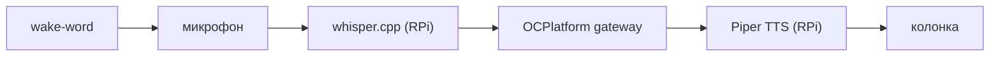
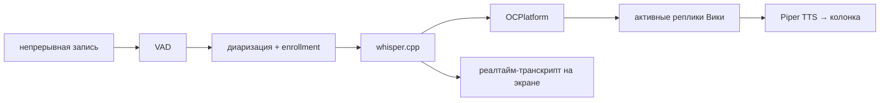
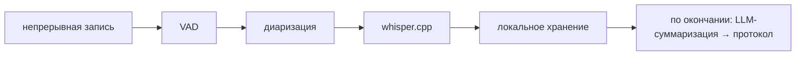
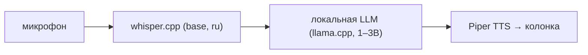

# Навыки Вики

> Статус: ✅ актуален · Обновлено: 2026-07-07 · Связанные документы:
> [архитектура](../architecture/overview.md), [приватный режим](../architecture/privacy-mode.md)

> Одна личность, несколько ролей. Переключение — голосом или контекстно.

## Общее

- Все навыки используют **одно и то же железо** (RPi + микрофонный массив + колонка).
- Все используют **одну и ту же Вику** (память, характер, инструменты в OCPlatform).
- Отличаются только: что она делает + куда идут данные.

---

## 🏠 Навык 1 — Домашний ассистент

**Триггер:** wake-word «Вика» → сразу разговор.

**Данные уходят:** транскрипт запроса → OCPlatform (только по TLS — требование, см.
[модель угроз](../architecture/security-threat-model.md)).

**Индикация:** синий пульс LED-кольца во время разговора.

**Использование:** «Вика, что у меня сегодня?» · «напомни через час выпить воды» ·
«что нового в GrandHub?»

---

## 🎯 Навык 2 — Фасилитатор встреч

**Триггер:** «Вика, начнём встречу» или кнопка на устройстве.

**Что делает Вика:**

- Следит за таймингом («мы 20 минут на этой теме, идём дальше?»)
- Задаёт уточняющие вопросы, если решение неоднозначно
- Выявляет action items и назначает ответственных
- Модерирует брейншторм (собирает идеи, потом группирует)
- В конце: протокол + список задач → отправка в Telegram/Notion/Trello

**Данные уходят:** полный транскрипт → OCPlatform (TLS).

**Индикация:** зелёное вращение LED (запись + анализ).

---

## 📝 Навык 3 — Транскрайбер

**Триггер:** «Вика, просто запиши» или кнопка REC.

**Отличие от фасилитатора:** Вика молчит (нет TTS-ответов), не задаёт вопросов,
не модерирует — только запись + структурирование в конце.

**Данные уходят:** транскрипт → OCPlatform для суммаризации; в Edge-редакции и приватном
режиме — суммаризация локально, наружу ничего.

**Индикация:** белое ровное свечение.

Пользовательские сценарии встречи (знакомство/встреча/после) — [scenarios.md](scenarios.md).

---

## 🔒 Навык 4 — Приватный режим

**Триггер:** «Вика, приватный режим» — модификатор поверх любого из навыков 1–3.

**Ключевое ограничение:** **ничего не уходит в сеть** (в продуктовой версии —
физическая airgap-кнопка). Техническая реализация и модель гарантий —
[privacy-mode.md](../architecture/privacy-mode.md).

**Что теряется:** долгосрочная память OCPlatform, инструменты (календарь, Notion),
качество ответов ниже (LLM 1–3B).

**Что остаётся:** транскрипция (whisper.cpp base — хорошее качество), базовые ответы,
локальная суммаризация встречи.

**Индикация:** **красное** свечение LED — визуально видно, что режим включён.

**Выход:** «Вика, обычный режим» или таймер («приватный режим на 2 часа»).

**Целевое использование:** психолог/юрист/врач с клиентом, совещания под NDA,
домашние разговоры не для облака.

---

## Переключение между навыками

| Как | Пример |
|-----|--------|
| Голосом | «Вика, начнём встречу», «Вика, приватный режим» |
| Контекстно | утром сама включает home; при >2 голосах предлагает facilitator |
| Кнопкой | физическая кнопка на устройстве (продуктовая версия) |

Приватный режим — **модификатор**: «Вика, начнём встречу в приватном режиме» →
фасилитатор + всё локально.
