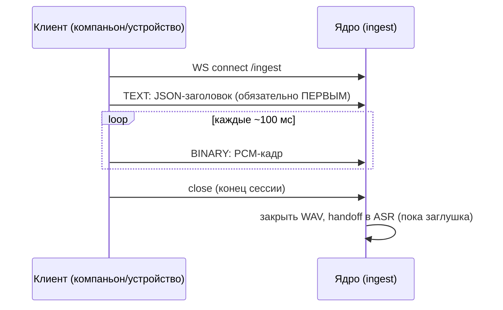

# Протокол ingest (WebSocket), v1

> Статус: ✅ актуален (соответствует скелету) · Обновлено: 2026-07-07 · Связанный ADR:
> [0009](../../adr/0009-ingest-protocol.md) · Реализация: `software/core/api/ingest_ws.py`,
> клиент: `software/companion-client/system_audio_client.py`

## Эндпоинты

| Метод | Путь | Назначение |
|-------|------|-----------|
| WS | `/ingest` | приём аудиопотока (этот документ) |
| GET | `/health` | liveness: `{"ok": true}` |

## Последовательность



## Заголовок сессии (первое сообщение, TEXT/JSON)

```json
{"v": 1, "rate": 16000, "format": "pcm_s16le", "channels": 1, "source": "system"}
```

| Поле | Тип | Обязательное | Значения / по умолчанию |
|------|-----|--------------|--------------------------|
| `v` | int | нет (рекомендуется) | версия протокола; отсутствие трактуется как `1` |
| `rate` | int | нет | частота дискретизации, Гц; по умолчанию `16000` |
| `format` | str | нет | только `pcm_s16le` в v1 |
| `channels` | int | нет | только `1` (моно) в v1 |
| `source` | str | нет | `system` \| `mic` \| `both` \| `device` \| `line_in` \| `test` |
| `token` | str | да, если ядро запущено с `VIKAVOICE_INGEST_TOKEN` | токен устройства; сравнение постоянного времени |

## Аудио-кадры (BINARY)

PCM little-endian, 16 бит, моно, частота из заголовка. Рекомендуемый размер кадра —
100 мс (`rate / 10` сэмплов × 2 байта). Кадры без пауз, сервер не подтверждает каждый кадр.

## Ошибки протокола

| Ситуация | Поведение сервера |
|----------|-------------------|
| Бинарный кадр до заголовка | close `1003` («первым сообщением должен быть JSON-заголовок»); сессия не создаётся, файл не пишется |
| Повторный TEXT-заголовок | close `1003` |
| Невалидный JSON в заголовке | close `1003` |
| Неверный/отсутствующий `token` (при включённой аутентификации) | close `1008`; сессия не создаётся |
| Разрыв соединения | сессия закрывается штатно: WAV финализируется, передаётся в ASR-заглушку |

## Результат сессии

WAV-файл `session_<uuid>.wav` в каталоге `VIKAVOICE_INGEST_DIR`
(по умолчанию `data/ingest_sessions` относительно рабочего каталога ядра;
см. [configuration.md](../configuration.md)).

## Ограничения v1 (зафиксированы, план — ADR-0009)

- ✅ **Аутентификация токеном** реализована: env `VIKAVOICE_INGEST_TOKEN` на ядре +
  поле `token` в заголовке. Без переменной — открытый режим (только доверенная LAN,
  [threat model, T1](../../architecture/security-threat-model.md)).
- ❗ **Нет TLS в самом ядре** — `wss://` терминировать реверс-прокси (nginx/caddy) перед ядром.
- Нет сжатия (Opus) — для тонкого устройства через интернет будет дорого по трафику.
- Нет resume при разрыве — новая сессия = новый файл.
- Нет backpressure/квот (T10).
